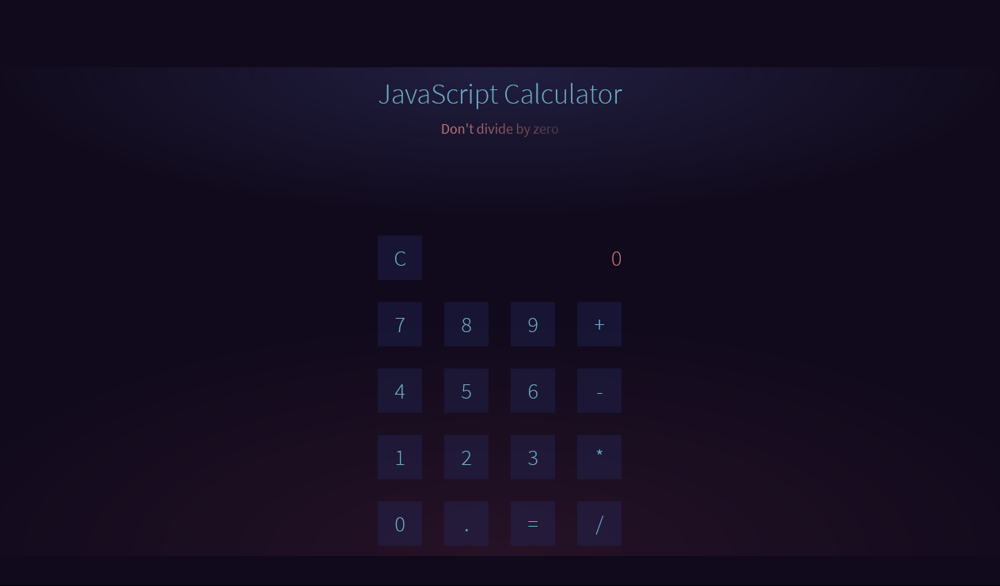

# API Calculator
This is a simple calculator using API. this project is to fulfill assignment 1 of Layanan Aplikasi Web (web service) 2020/2021. 
notes : while using API is definitely not effective (taking too long rather than using js) this project goals is to practice REST API
-REST URL : https://rest-side-calculator.herokuapp.com/ (no gui, but api is accesible)
-WEB URL : https://web-side-calculator.herokuapp.com/


### How It Works
1. client put input (put a number -> click an operation -> put another number -> click equal)
2. parameter passed through ajax (to web-side/api) to be proceed in the server
3. web-side pass the request to rest-side/calculate
4. rest-side/calculate proceed the parameter and return the result to web-side/api
5. web-side/api pass the result to client side program (the ajax)
6. javascript take the result and show it to the client interface

### Snapshot


### Tools/Technologies
1. rest api
2. jquery ajax
3. django
4. [Dependency](./requirements.txt)
  
### Installation
to run this program simply clone this repo. and the api repo ([rest-side repository link](https://github.com/irfanmaulananasution/rest-side-calculator)) and run the django
```
git clone <web repo link>
git clone <api repo link>
```
```
//for local testing you can try this. and change the link in calculate-api method at WEB/index/views.py to where you will put your own rest api (or you can let it be to use mine which available online)
//for the api use port 3000
manage.py runserver 3000
//for the web use port 8000
manage.py runserver 8000
```


### Important Usage Notes
There is an unhandled error in this program you should avoid in using this program. this error is the result of ajax (being too long to return the result) usage to the original js template. if by any chance you encounter this error simply hard refresh the page
1. usage error. you can only run one operation at a time (before the result is out)
2. usage error. you can only hit equal buttone once at a time (before the result is out)

  
### Author
- Irfan Maulana Nasution

### License
[MIT](./LICENSE.txt)